Lab instructions for `Workshop Plus: Secure DevOps`  

**Secure DevOps - Prerequisites:**

`Azure DevOp Organization` and `Pipeline` setup

**Conditions and Terms of Use**

**Microsoft Confidential**

This training package is proprietary and confidential and is intended only for uses described in the training materials. Content and software is provided to you under a Non-Disclosure Agreement and cannot be distributed. Copying or disclosing all or any portion of the content and/or software included in such packages is strictly prohibited.

The contents of this package are for informational and training purposes only and are provided "as is" without warranty of any kind, whether express or implied, including but not limited to the implied warranties of merchantability, fitness for a particular purpose, and non-infringement.

Training package content, including URLs and other Internet Web site references, is subject to change without notice. Because Microsoft must respond to changing market conditions, the content should not be interpreted to be a commitment on the part of Microsoft, and Microsoft cannot guarantee the accuracy of any information presented after the date of publication. Unless otherwise noted, the companies, organizations, products, domain names, e-mail addresses, logos, people, places, and events depicted herein are fictitious, and no association with any real company, organization, product, domain name, e-mail address, logo, person, place, or event is intended or should be inferred.

**Copyright and Trademarks**
© 2019 Microsoft Corporation. All rights reserved.

Microsoft may have patents, patent applications, trademarks, copyrights, or other intellectual property rights covering subject matter in this document. Except as expressly provided in written license agreement from Microsoft, the furnishing of this document does not give you any license to these patents, trademarks, copyrights, or other intellectual property.

Complying with all applicable copyright laws is the responsibility of the user. Without limiting the rights under copyright, no part of this document may be reproduced, stored in or introduced into a retrieval system, or transmitted in any form or by any means (electronic, mechanical, photocopying, recording, or otherwise), or for any purpose, without the express written permission of Microsoft Corporation. 
For more information, see Use of Microsoft Copyrighted Content at  
http://www.microsoft.com/en-us/legal/intellectualproperty/Permissions/default.aspx

DirectX, Hyper-V, Internet Explorer, Microsoft, Outlook, OneDrive, SQL Server, Windows, Microsoft Azure, Windows PowerShell, Windows Server, Windows Vista, and Zune are either registered trademarks or trademarks of Microsoft Corporation in the United States and/or other countries. Other Microsoft products mentioned herein may be either registered trademarks or trademarks of Microsoft Corporation in the United States and/or other countries. All other trademarks are property of their respective owners.
  

**Prerequisites**

- Edge Chromium or Chrome
- Recomended a new @outlook or @hotmail account, e.g: DevSecOpsYourName@outlook.com at https://account.microsoft.com using a InPrivate/Incognito browser Window

    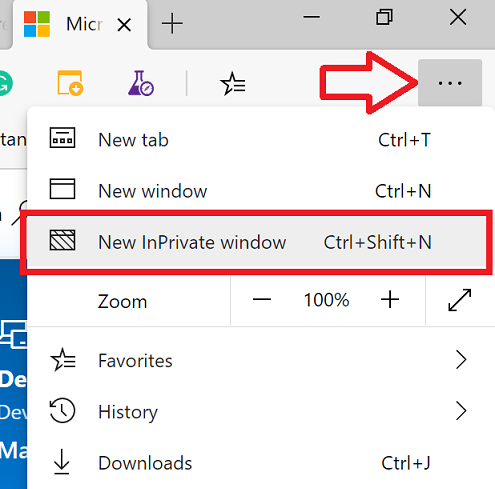

**Overview**
In this pre-work module (lab 2 of 2) you will setup your `Azure DevOps` environment including the initial `Build Pipeline` and `Release Pipeline`.
- Azure DevOps organization and project
- Clone the source repo into the azure DevOps project
- Create and test initial build pipeline
- Create and test initial release pipleine

[[_TOC_]]

## Create an Azure DevOps
1. Navigate to https://dev.azure.com/ Click `Start Free`
    
    

  > **If asked create a new private project e.g. DevSecOps**

   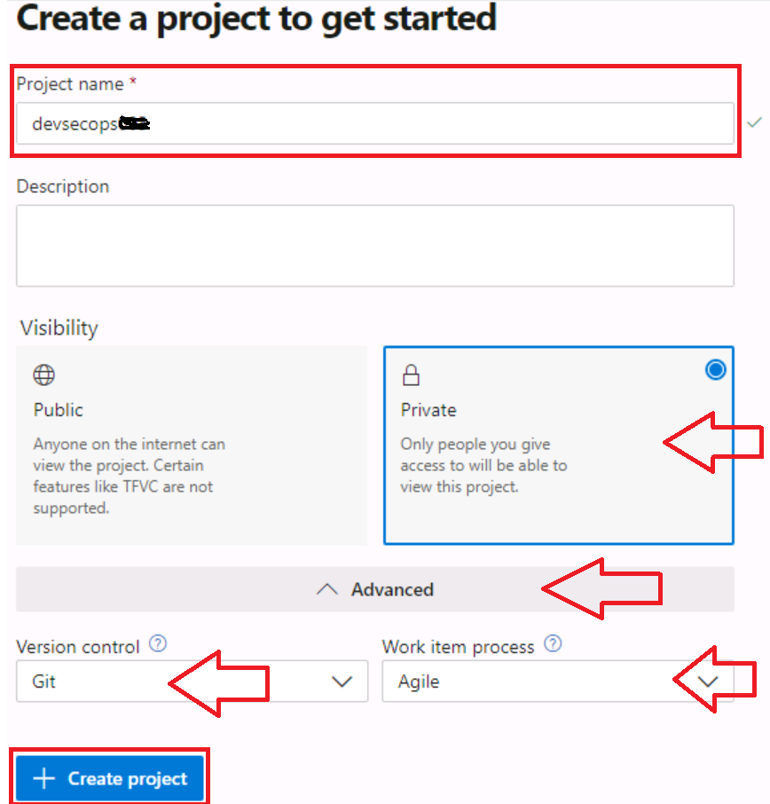

2. Login with your new Microsoft account and Select `Continue`
    
    

3. In your new Organization, create a Personal Access Token ([PAT](https://docs.microsoft.com/en-us/azure/devops/organizations/accounts/use-personal-access-tokens-to-authenticate?view=azure-devops&viewFallbackFrom=vsts&tabs=preview-page#create-personal-access-tokens-to-authenticate-access))
    
    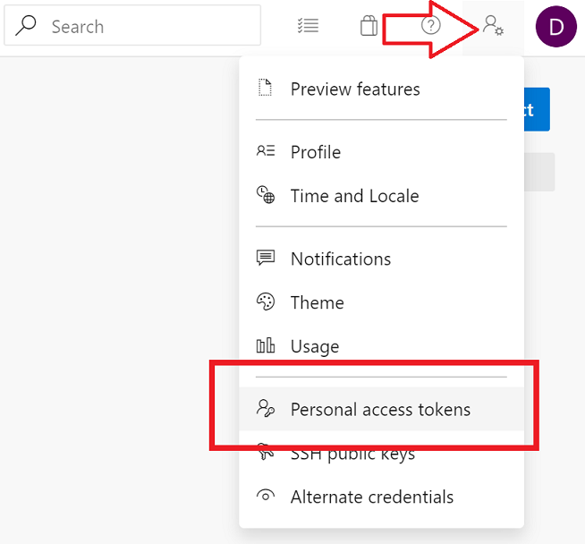
    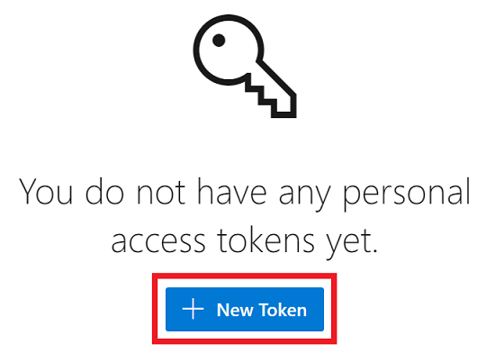

4. Name the Personal Access Token (PAT) as `DevSecOps`, select Full access and click `Create`

   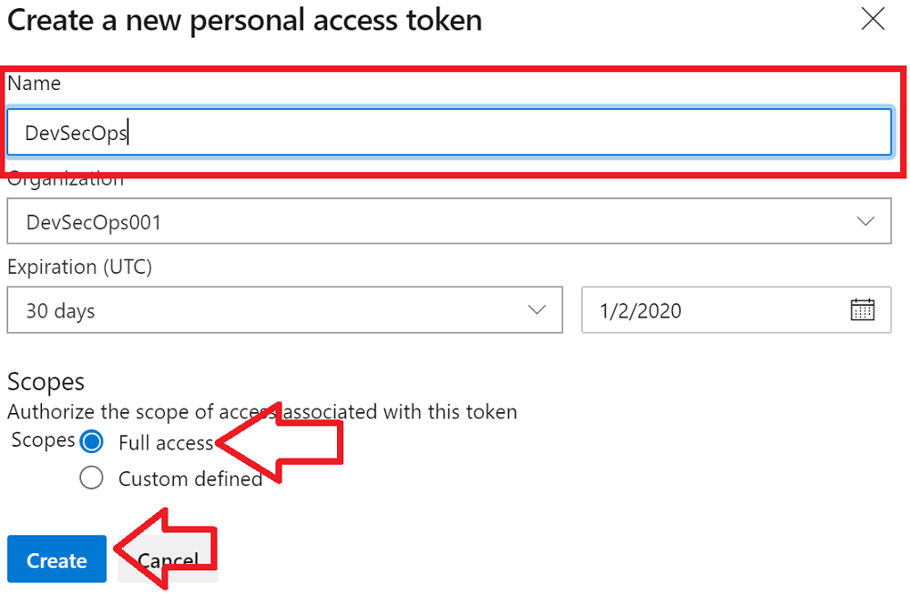

   > **Save your new token key in a notepad**
   
    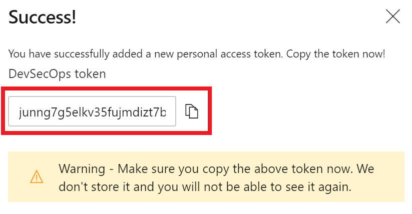

   > **Save your new token key in a notepad**

## Get you free Azure Subscription

1. Navigate to http://aka.ms/azurepass and use the Promo code located in your VM
    
    
    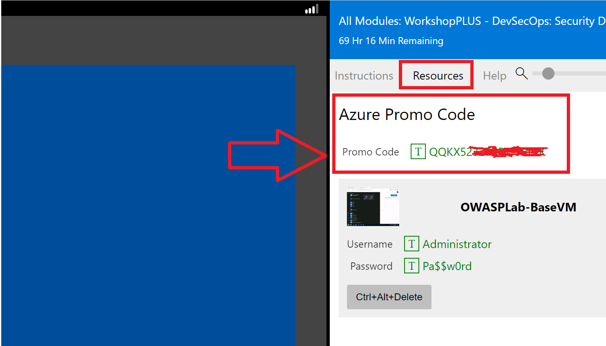
    
    Click Claim
    
    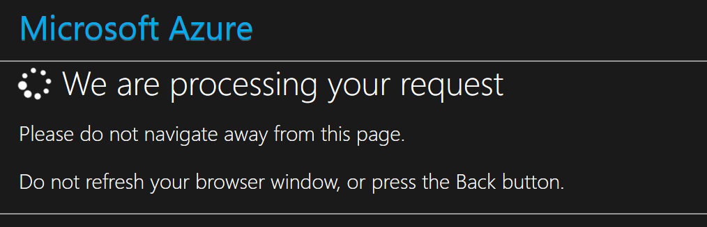

2. Fill all fields and click Next
    
    

3. Accept the terms and click ``Sign up``
    
    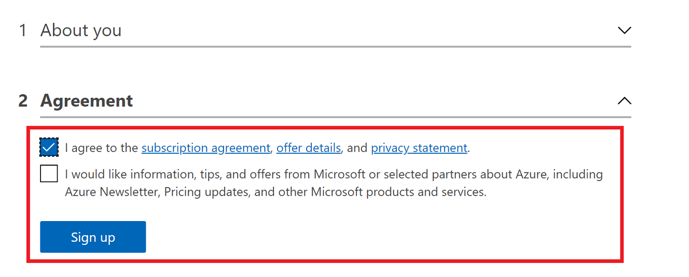
  
> Attention
> 
> **This process will take about 15 minutes, don't refresh your screen!**
> ---
    

## Create the Infrastructure in Azure

1. Run the following commands inside the VM on PowerShell:
    
    > For the following command answer with A for `[A] Yes to All`

    A)  Set-ExecutionPolicy -ExecutionPolicy RemoteSigned -Scope CurrentUser  

    B)  Invoke-WebRequest 'https://aka.ms/DevSecOpsSetupFile' -UseBasicParsing -OutFile .\IaC-AzureEnvCreation.ps1
        
    > Type the following command and hit `Enter` follow the instructions.

    C)  .\IaC-AzureEnvCreation.ps1

    **Keep the following information in a notepad, you will be asked for those values in the executing script.**

    a) URL DevOps with your organization name (See following image)
    b) Project Name (See following image)
    c) Personal Token Access (PAT), obtained in the step 4 of **Create an Azure DevOps**

    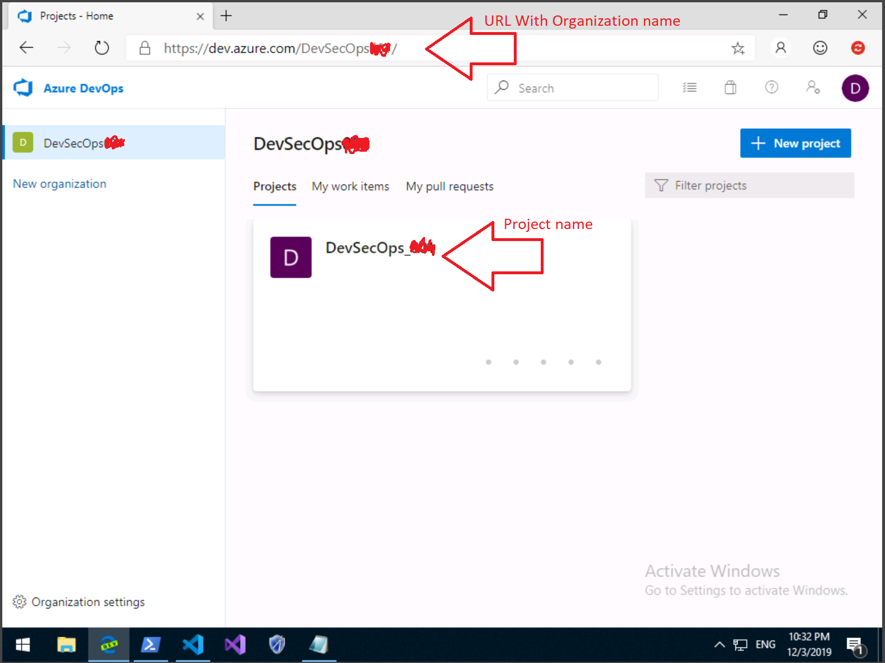

    **The script will take about 15 minutes to execute.**
    **If any task fails during the execution of the script, delete the newly created resource groups and run the script again**
    **Script failures typically use red lettering unless you changed the CLI color scheme**
     
    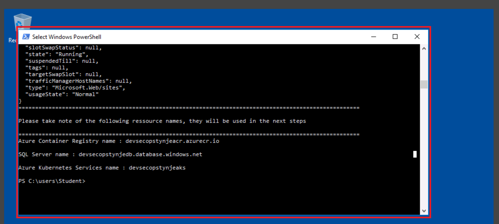

    > Optional
    > 
    > You can navigate to https://portal.azure.com in the resource group DevSecOps-xxxxx-RG and see all resources created to the workshop
    >
    > Explore as well the new repo created in your Organization-->Project named MyHealthClinicSecDevOps-Public in https://dev.azure.com 