# Secure DevOps and Web Application Security

**Module 4: Automating a Secure and Compliant Pipeline**

Student Lab Manual

[[_TOC_]]

**Introduction**

**Objectives**

After completing this lab, you will be able to:

- Trigger a build and a deployment of an application

- Secure your application and infrastructure through tooling and
    automation

**Prerequisites**

Completion of the Secure DevOps Prerequisites document.

Completion of the Module 1 Lab, Creating a DevOps Pipeline

**Estimated Time to Complete This Lab**

30 minutes

## Lab 1 - Configure Build Pipeline for SonarQube

**Objectives**

After completing this exercise, you will be able to:

- Integrate Static Code Analysis (SCA) into the Azure DevOps Pipeline

**Scenario**

In this exercise, we will use some of the capabilities of SonarCloud.

SonarQube® is an open-source platform developed by SonarSource for
continuous inspection of code quality to perform automatic reviews with
static analysis of code to detect bugs, code smells, and security
vulnerabilities on 20+ programming languages. SonarCloud offers reports
on duplicated code, coding standards, unit tests, code coverage, code
complexity, comments, bugs, and security vulnerabilities. SonarCloud is
the leading product for Continuous Code Quality. It supports all major
programming languages, including C\#, VB .Net, JavaScript, TypeScript,
C/C++ and many more. Integrate it in your on-premise TFS installation,
and continuously track down bugs and vulnerabilities in your codebase.
This extension provides build tasks that you can add in your build
definition. The tool can be integrated for pull-requests to
automatically analyze source code before commits, allowing you to
discover bug or vulnerability early in the process.

### Exercise - 1: Configure a SonarQube Project and configure Quality Gate**

1.  Access the SonarQube URL provided on the pre-requisites e.g.: http://devsecopsXXXXXsnrdns.eastus.azurecontainer.io:9000

    > Important: The default port for SonarQube is 9000. Copy the DNS name from the created Container Instance in Azure Portal as shown and append :9000 at the end. The final SonarQube URL will be http://YOUR_DNS_NAME:9000

  
2.  Open a browser and login to the SonarQube Portal using the following credentials-

    > Username= admin, Password= admin

    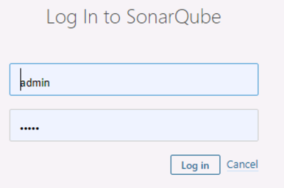

3.  Choose `Administration` in the toolbar, click Projects tab and then `Management`.
  
    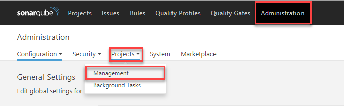

4.  Create a project with `Name` and Key as `DevSecOps`.

    a) `Name`: Name of the SonarQube project that will be displayed on the web interface.
    b) `Key`: The SonarQube project key that is unique for each project.
    c) Leave the `Visibility` option to `Private`.

    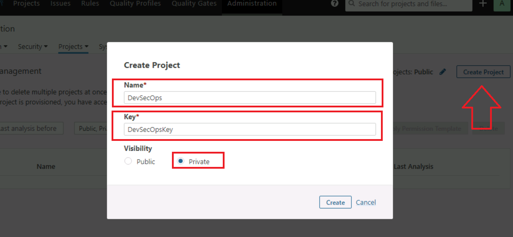

    Let us create a Quality Gate to enforce a policy which fails the gate if there are bugs in the code. A Quality Gate is a PASS/FAIL check on a code quality that must be enforced before releasing software.

5. Click the `Quality Gates` menu and click `Create` in the Quality Gates screen. Enter a name for the Quality Gate and click `Create`.

    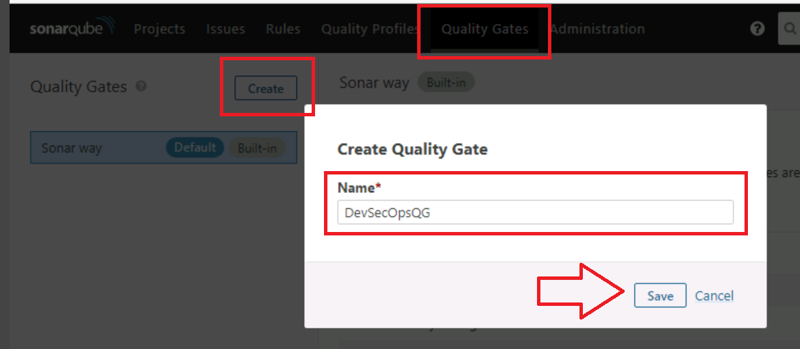

6. Let us add a condition to check for the number of bugs in the code. Click on `Add Condition` drop down, choose the value `Vulnerabilities`.
 
    > Set the `Operator` value to `is greater than` value to 1 and click on the `Add condition` button.
    
    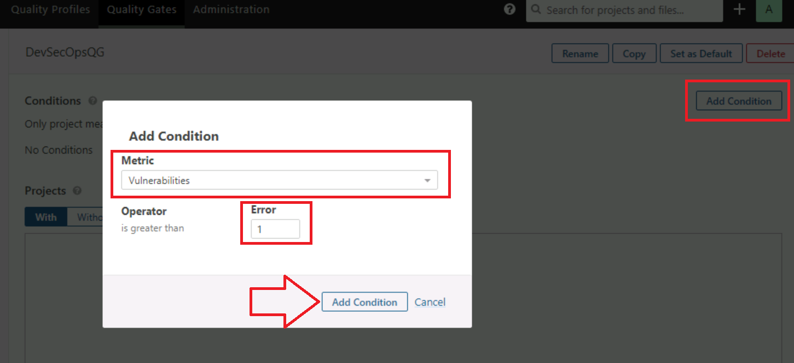

    > **Note**: This condition means that if the number of Vulnerabilities in Sonar Analysis is greater than 1 , then the quality gate will fail and optionally this fails the DevOps build.

7.  To enforce this quality gate for DevSecOps project, click on `All` under `Projects` section and select the project checkbox.

    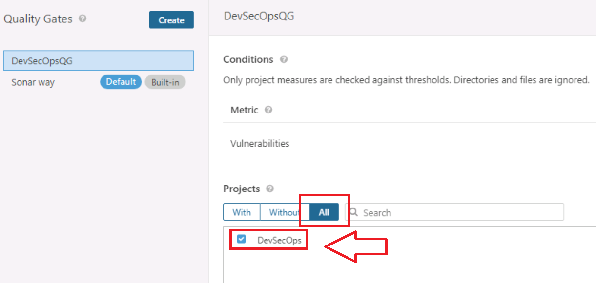

8.  Navigate to `My Account` then `Security` tab, in the field `Enter Token Name` type `DevSecOps` and click `Generate`, Copy the generated token in a notepad.

    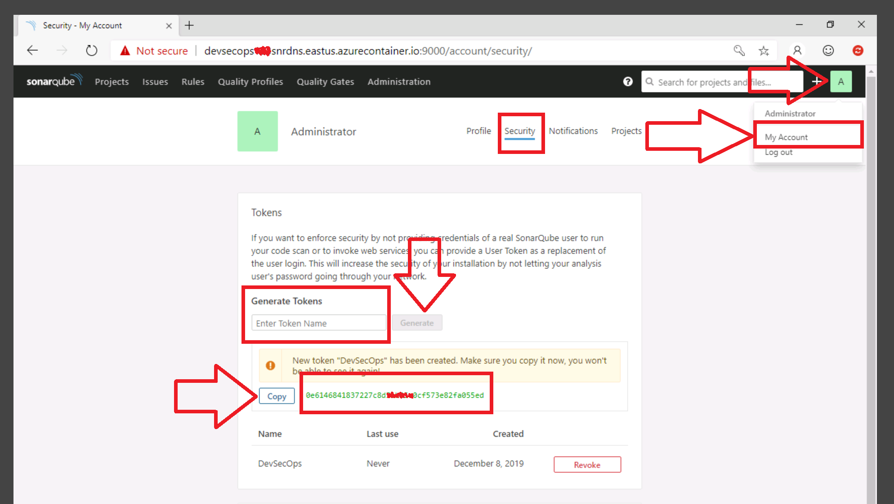

    > **Note**: The tokens are used to run analysis or invoke web services without access to the user’s actual credentials.

### Exercise - 2 : Integrate SCA in the Build Pipeline**

1. In Azure Pipelines, navigate to the `Builds` page and select `MyHealth.AKS.build` Pipeline and Click on `Edit`

    

2. On the Tasks tab `Agent Job 1`, select the plus sign ( + ) and search for the `Prepare analysis Configuration` task, and then select `Add` before `Run Services` task.

    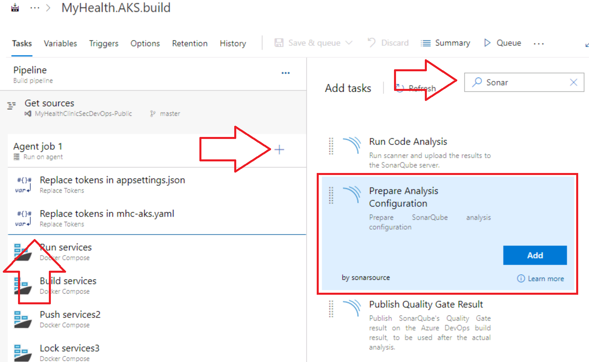

3. `Prepare Analysis on SonarQube` Configuration task is to configure all the required settings before executing the build. Click `+ NEW` to add SonarQube server endpoint.

    a) Chose `Use standalone scanner`
    b) Mode `Manually provider configuration`
    c) Project Key `DevSecOpsKey`
    d) Project name `DevSecOps`

    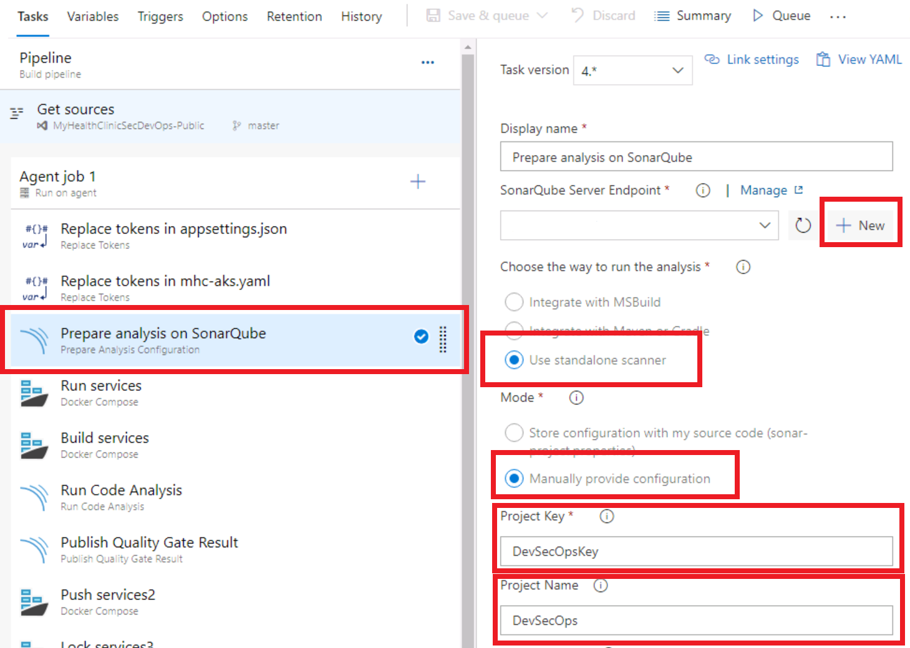

    In the Add `SonarQube service connection` wizard enter the SonarQube **server URL** (e.g.: http://devsecopsXXXXXsnrdns.eastus.azurecontainer.io:9000), the SonarQube **security token** and in **Service Connection Name**  `DevSecOps-Private`. 

    If you don’t have SonarQube security token follow 
    [this](https://docs.sonarqube.org/latest/user-guide/user-token/) to create one. And make sure SonarQube project name and project key are same as you entered while creating SonarQube project in `Exercise 1`.

    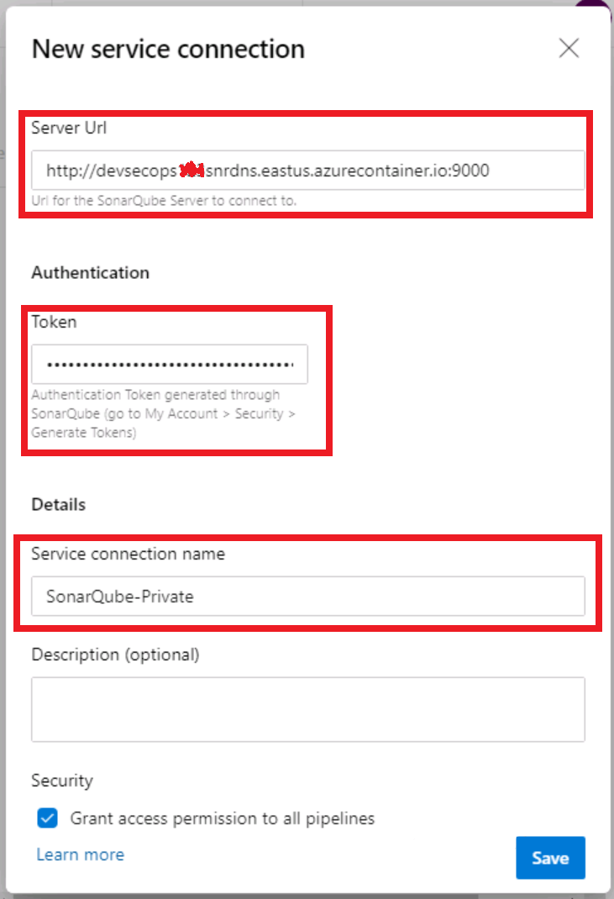

    >  **Note**: The tokens are used to run analysis or invoke web services without access to the user’s actual credentials.    

4. Make sure the following options are properly configured in the Prepare Analysis task:

    a) Select `Use Standalone Scanner`

    b) Select `Manually provide configuration`

   

5. Add a new task `Run Code Analysis` after Build services.

      

6. Add a new task `Publish Quality Gate Result` after `Run Code Analysis`.

      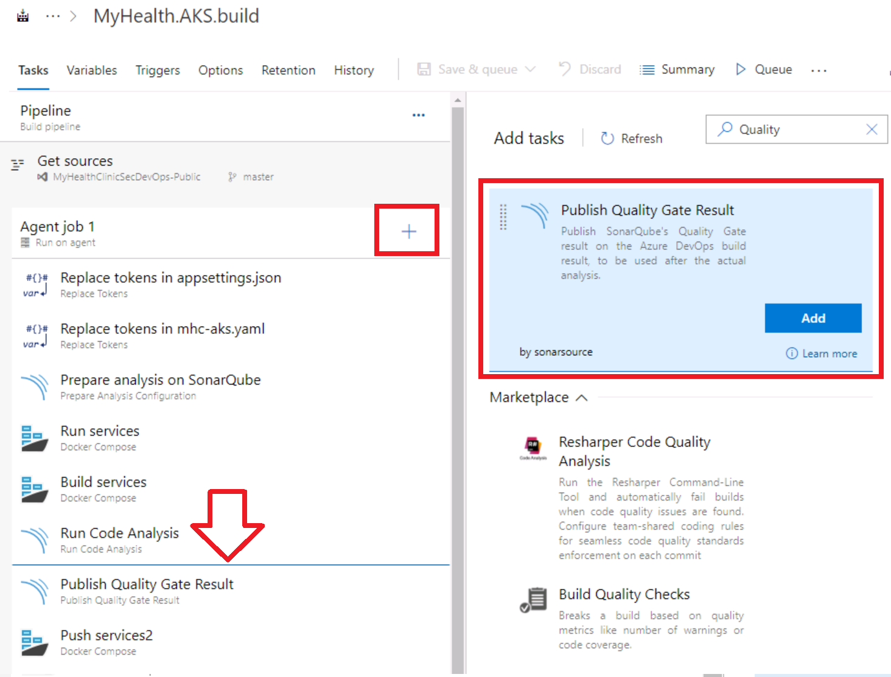

      This step will provide a summary of the analysis results on your SonarQube Instance created on the requistes.

7. Save and queue the build.

8. Check the result of Sonar Analysis e.g. :
    <http://devsecopsXXXXXsnrdns.eastus.azurecontainer.io:9000>

    > **Note** This URL was created in the Requisites before module 1

## Lab 2 - Managing Open-source security and licenses with WhiteSource Bolt

**Introduction**

WhiteSource is the leader in continuous open source software security
and compliance management. WhiteSource integrates into your build
process, irrespective of your programming languages, build tools, or
development environments. It works automatically, continuously, and
silently in the background, checking the security, licensing, and
quality of your open source components against WhiteSource
constantly-updated definitive database of open source repositories.

WhiteSource provides WhiteSource Bolt, a lightweight open source
security and management solution developed specifically for
integration with Azure DevOps and Azure DevOps Server. It works per
project and does not offer real-time alert capabilities like the Full
platform which is generally recommended for larger development teams,
wanting to automate their open source management throughout the entire
software development lifecycle (from the repositories to
post-deployment stages) and across all projects and products.

**Objectives**

After completing this lab, you will be able to:

- Detect and remedy vulnerable open source components.
- Generate comprehensive open source inventory reports per project or build.
- Enforce open source license compliance, including dependencies licenses.
- Identify outdated open source libraries with recommendations to update.

**Prerequisites**

Completion of the Module 1 Lab, Creating a DevOps Pipeline

**Estimated Time to Complete This Lab:**

**30 minutes**

**Exercise - 1 : Activate WhiteSource Bolt**

1. In your Azure DevOps Project, under Pipelines section, go to White
    Source Bolt tab, provide your Work Email, Company Name, Country and
    click Get Started button to start using the Free version.

    

    Upon activation, the below message is displayed.
    

2. Go back and edit the `MyHealth.AKS.build` build definition and Add the `WhiteSource Bolt task` to your pipeline.

    

3. Set the Root working directory to `src`.

    

4.  Navigate to `White Source Bolt` tab under `Pipelines` section
    and wait for the report generation of the completed build to see the
    vulnerability report.

    

## Lab 3 - Secure DevOps Kit for Azure

**Introduction**

In this exercise, we will use some of the capabilities of the Secure DevOps Kit for Azure (AzSK). The Secure DevOps Kit for Azure (AzSK) is a collection of scripts, tools, extensions, automation, etc. that caters to the end to end Azure subscription and resource security needs using extensive automation and smooth integration to native DevOps workflows. Please refer to https://azsk.azurewebsites.net for more details.

**Objectives**

After completing this lab, you will be able to:

-   Detect and remedy vulnerable your Azure Subscription.

**Prerequisites**

Completion of the Module 1 Lab, Creating a DevOps Pipeline

**Estimated Time to Complete This Lab**

30 minutes

### Exercise 1: Release Pipeline

1. Under `Pipelines`, click on `Releases` and
    select `Edit`. Click on the `Tasks` tab and in the `Dev`
    Environment create a new deployment phase by clicking on the three
    dots and selecting `Add an agent job`. This will be a Hosted
    Windows Agent as the AzSK job is supported only on Windows.

    

2. In the display name enter `AzSK` and in the `Agent pool` select \"windows-2019\".

    

3. Click the plus sign `( + )` and search for \"AzSK\". Add the task `AzSK Security Verification Tests` by clicking on `Add`.

    

4. Set the `Display name` for the task to `Secure Devops kit for
    Azure` and set your `Azure Subscription`. In the `Select the
    Parameter Set` dropdown select \"ResourceGroupName\". Set
    the `ResourceGroup Name` to the one created for this lab. Set
    the `Subscription ID` to the Id of the subscription hosting the
    resources. You will run the Security Verification Tests (SVTs) on
    the `Subscription ID`. You can get this ID by running the command:

    `az account show`

    The final config should be like this:

    

    > Note: In order to generate the **Autofix scripts** which are useful for Remediation include the ExtendedCommand variable in the pipeline with the switch -GenerateFixScript. Check the `Variables` section under the release definition the value `ExtendedCommand` variable with the switch `  -GenerateFixScript` as value.

5.  Click `Save` and Run the Release pipeline by clicking on `Release` and
    selecting `Create a new release`. Click on `Create`

### Exercise 2: Remediation

1. Navigate to the `Release` section under the `Pipelines` menu,
    select `MyHealth.AKS.Release` and select the latest release.

    

2. In the  \"Dev\" `Stages` click `Logs` under the failed release.
   
    

3. Click the failed task `Secure Devops Kit for Azure` for detailed
    description about the scan results.

    

4. Scroll down to verify the number of passed and failed Controls.

    

5. Click the `Download all logs` to download all the logs to you
    local machine.

    

6. After downloading the logs, navigate to the below path and extract
    the AzSK Logs.

    

7. This consists of the Security Report in CSV format and also the
    AutoFix Scripts that you can use to fix the failed Controls that are
    supported.

    

8. Just for illustration, if you open the file `SecurityRepor...csv` in the Excel you can check for the controls which can be Fixed by the Scripts. In the image below Excel sheet shows only one control that is supported by the AutoFix scripts.

    

9. Navigate to the `FixControlScripts` folder and check the scripts
    generated in the `Services` folder to see what they do.

    

> (Optional maybe not work, preview features)

10. To run these scripts read the instructions in
    the `README.txt` file.

11. After running the scripts, trigger the Pipeline and verify the
    results. Note that you will need to manually fix the Controls that
    do not generate the AutoFix Scripts.
