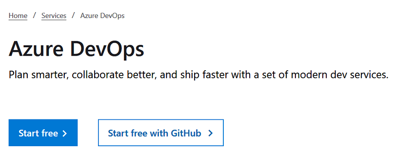
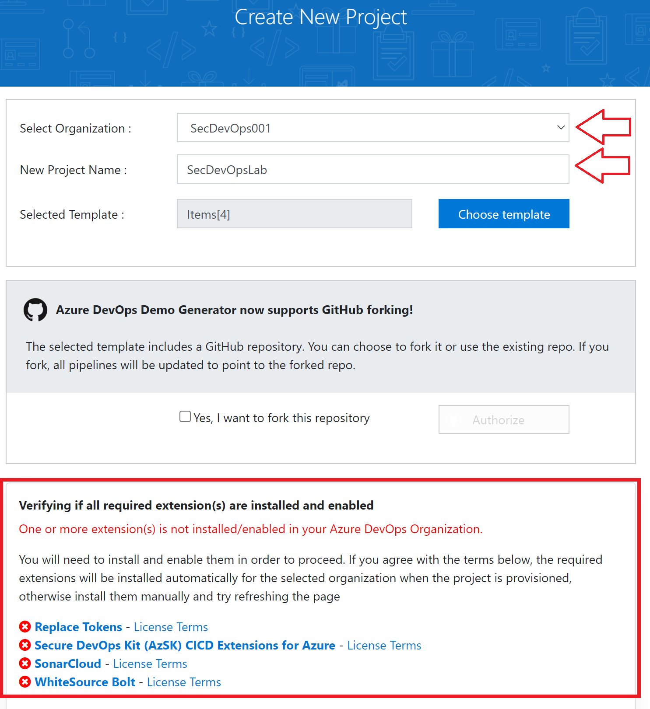
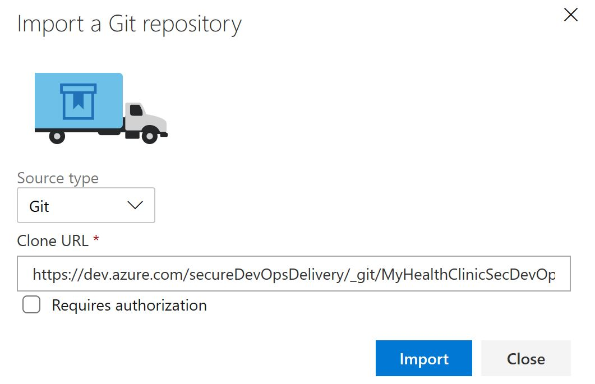
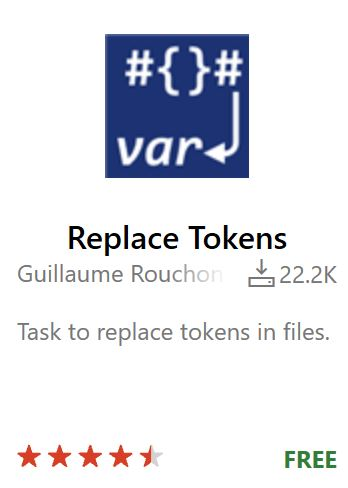
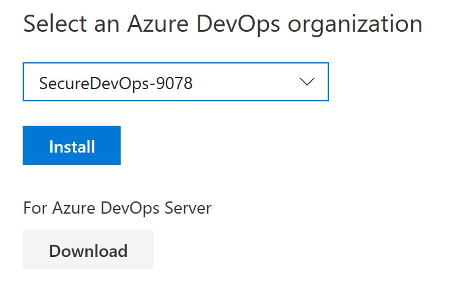

Lab instructions for `Workshop Plus: Secure DevOps`  

**Secure DevOps - Prerequisites:**

`Azure DevOp Organization` and `Pipeline` setup

**Conditions and Terms of Use**

**Microsoft Confidential**

This training package is proprietary and confidential and is intended only for uses described in the training materials. Content and software is provided to you under a Non-Disclosure Agreement and cannot be distributed. Copying or disclosing all or any portion of the content and/or software included in such packages is strictly prohibited.

The contents of this package are for informational and training purposes only and are provided "as is" without warranty of any kind, whether express or implied, including but not limited to the implied warranties of merchantability, fitness for a particular purpose, and non-infringement.

Training package content, including URLs and other Internet Web site references, is subject to change without notice. Because Microsoft must respond to changing market conditions, the content should not be interpreted to be a commitment on the part of Microsoft, and Microsoft cannot guarantee the accuracy of any information presented after the date of publication. Unless otherwise noted, the companies, organizations, products, domain names, e-mail addresses, logos, people, places, and events depicted herein are fictitious, and no association with any real company, organization, product, domain name, e-mail address, logo, person, place, or event is intended or should be inferred.

**Copyright and Trademarks**
© 2019 Microsoft Corporation. All rights reserved.

Microsoft may have patents, patent applications, trademarks, copyrights, or other intellectual property rights covering subject matter in this document. Except as expressly provided in written license agreement from Microsoft, the furnishing of this document does not give you any license to these patents, trademarks, copyrights, or other intellectual property.

Complying with all applicable copyright laws is the responsibility of the user. Without limiting the rights under copyright, no part of this document may be reproduced, stored in or introduced into a retrieval system, or transmitted in any form or by any means (electronic, mechanical, photocopying, recording, or otherwise), or for any purpose, without the express written permission of Microsoft Corporation. 
For more information, see Use of Microsoft Copyrighted Content at  
http://www.microsoft.com/en-us/legal/intellectualproperty/Permissions/default.aspx

DirectX, Hyper-V, Internet Explorer, Microsoft, Outlook, OneDrive, SQL Server, Windows, Microsoft Azure, Windows PowerShell, Windows Server, Windows Vista, and Zune are either registered trademarks or trademarks of Microsoft Corporation in the United States and/or other countries. Other Microsoft products mentioned herein may be either registered trademarks or trademarks of Microsoft Corporation in the United States and/or other countries. All other trademarks are property of their respective owners.
  

**Prerequisites**
- Recomended a new @outlook or @hotmail account, e.g: mynameyyyymm@outlook.com

**Overview**
In this pre-work module (lab 2 of 2) you will setup your `Azure DevOps` environment including the initial `Build Pipeline` and `Release Pipeline`.
- Azure DevOps organization and project
- Clone the source repo into the azure DevOps project
- Create and test initial build pipeline
- Create and test initial release pipleine

[[_TOC_]]

## Create an Azure DevOps
1. Navigate to https://dev.azure.com/ Click ``Start Free``
    

2. Login with your new Microsoft account and Select `Continue`
    

3. Navigate to https://azuredevopsdemogenerator.azurewebsites.net/ and Sign in with your new Account and Accept Terms
    

4. Select your Organization and in the ``New Project Name`` type `SecDevOpsLab` and click `Choose template`  
    

## Create an Azure DevOps organization and project
1. Navigate to https://dev.azure.com/ login with your Microsoft account and Select `Create new organization`

2. Check checkbox and click `Continue`  
    

3. Name your organization `SecDevOps-NNNN` where NNNN is an random unique number . Select `US East`.  
    
    

4. Create a `Public` project called `SecDevOpsLab` and click `+ Create project`  
    

## Import (Clone) the repository

1. Click on the created project and navigate to `Repos` (on left side)
    
    

2. Click on `Import` button
    
    

3. Import the repo by pasting the below URL into the `Clone URL` field.  
    
    https://dev.azure.com/secureDevOpsDelivery/_git/MyHealthClinicSecDevOps-Public
    
    

4. Finally Download the imported project to your VM and Extract the Zip File
    

## Install DevOps extensions from Marketplace 
1. Navigate to market place (small shoping bag icon on upper right side)  

      
      

2. Install `Replace Tokens`  

      
3. `Get it free`  
 
      

4. Follow default instructions

      

5. Repeat for `Secure DevOps Kit (AzSK) CICD Extensions for Azure`, `WhiteSource Bolt` and `SonarCloud`

     
    
    

## Create the Infrastructure in Azure

1. Navigate to http://portal.azure.com open the shell command and create a storage using powershell
    

2. In powershell mode, select upload file
    

3. Select the file ``IaC-AzureEnvCreation.ps1``
    

4. Type CD in command prompt and hit enter
5. type ./IaC-AzureEnvCreation.ps1 and hit enter
    
6. Take note of the resource names when the script end his execution
    

